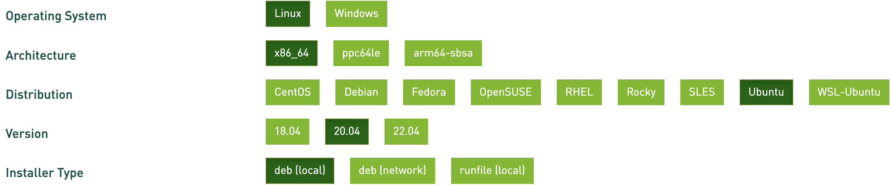

# Registration


## Registering a hotkey

Before you can begin mining Tao, you must first register a hotkey to the
network by solving the proof of work (POW) or by paying a fee with
`recycle_register`. The Bittensor network is comprised of 4096 Servers, and each
time a new hotkey is registered to the network, the lowest ranked miner is
kicked off of the network. POW registration will likely require GPUs.

## Registering with a GPU

Before you can utilize the CUDA registration, you must first install
CUDA-toolkit and cubit. Please note that CUDA registration only supports sm_86
enabled CUDA GPU (30XX series, Axxxx series or higher) Other GPUs may require
additional configuration for registration.

### Installing CUDA-toolkit

Install
[CUDA-toolkit 11.3](https://developer.nvidia.com/cuda-downloads?target_os=Linux&target_arch=x86_64&Distribution=Ubuntu&target_version=20.04&target_type=deb_local)
or higher in accordance with your operating system and version if you have yet
to do so. deb(local), deb(network), and runfile(local) should each be
sufficient installer types.




### Enter the Bittensor directory

```bash
cd ~/.bittensor/bittensor
```

### Install cubit

```bash
pip install git+https://github.com/opentensor/cubit.git@v1.1.2
```

### Troubleshooting and testing

Should the previous installation fail, you may install from source or a wheel:
[cubit installation](https://github.com/opentensor/cubit/#install)

You can check if your GPU is being seen through torch:

```python
# python3
import torch
torch.cuda.is_available()
```

A quick way to test if the GPU registration process is working properly is by
choosing the test network, Nobunaga, upon the miner startup described below.
Registration to the Nobunaga network should only take a few minutes. Additional
configurations may optimize your registration speed. Please see
[here](Arguments.md#cuda) for a full list of CUDA registration flags.

With your keys created and CUDA registration installed, you can now register
your miner. 

```bash
btcli register --cuda
```

Alternatively you may register and run your miner with `recycle register`.

```bash
btcli recycle_register
```

You will be immediately prompted to: 


## Enter a chain


To immediately gain access to Subtensor - our network blockchain - choose
"finney". Finney is useful for quick connections to the network like checking
your wallet balance, however it is not reliable for mining. For serious Servers
we recommend running an instance of [Subtensor locally](cli/Subtensor.md) in
order to maximize speed and connection. Should you be running Subtensor
locally, choose "local".

To familiarize yourself with the protocol without mining, choose our test
network, Nobunaga


## Enter a network uid

Enter the subnetwork that you wish to register too.


## Enter your wallet

Enter the name of your coldkey and hotkey credentials.
> Note: you will need a separate hotkey for each miner you register.
