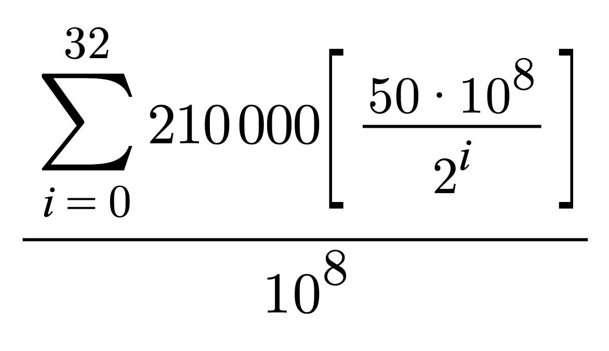

# Taokenomics

"Bittensor “fair launched” (no tokens were pre-mined) in 2021. The supply of Tao is capped at 21,000,000, so, like Bitcoin, it is scarce. There is also a halving cycle such that every 10.5 million blocks rewards per block are halved. Currently, every 12 seconds (one blockstep) a single Tao is minted into the network, giving allocation a consistency that safeguards against inflation. There will be 64 halving events in total with the first occurring in 2025. Follow this [link](https://explorer.nakamoto.opentensor.ai/#/explorer) to view the current supply and block number.

## Emissions between Servers and Validators

50% of each Tao minted per block is distributed to the Validators with the other 50% going to the Servers per the consensus mechanism. Validators earn Tao proportional to their stake in the network in regard to the [bonding matrix](Glossary.md#bonding-matrix). Validator emissions generally follow a normal distribution (bell curve), however, there are some possible [optimizations](../css/ValidatorCustomization.md) to be made to Validators that may improve their Tao earnings.

Servers compete amongst each other for the other 50% of Tao minted per block and are ranked on their performance by the Validators. Servers with higher rankings earn more Tao.

