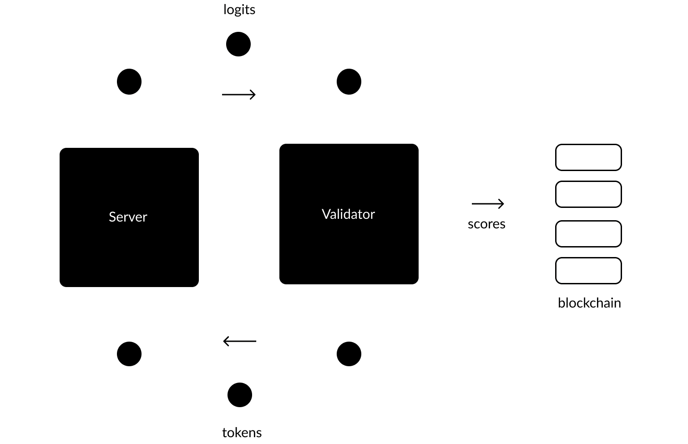

# The Protocol

There are two types of [nodes](src/../Glossary.md#miner/neuron/peer/node) that comprise the network: Servers and Validators. The Validators are tasked with “validating” the performance of the Servers, prompting them for information and assessing them according to their responses. These assessments are then relayed to the network blockchain, [Nakamoto](src/../Glossary.md#nakamoto), where currency is distributed. Servers are tasked with optimizing their responses so that they can compete with other Servers in the system for positive assessments, and therefore [currency](src/../Glossary.md#tao). The best preforming servers will recieve a larger portion of the limited supply of minted Tao.

Each validation process begins when a Validator locates a Server in the network and sends its [input](src/../Glossary.md#inputs) in the form of tokenized text, also referred to as [tokens](src/../Glossary.md#tokens). The Servers will then respond with [logits](src/../Glossary.md#logits), which represent their best attempt at [next token prediction (NTP)](src/../Glossary.md#next-token-prediction). This constitutes the central value-producing activity of the network. The Validator will then score each Server according to their response, using a series of information-based processes and game theoretic strategies to determine the usefulness of the information received. 

The Validators are able to do this efficiently because they have the data on hand that they are serving, they already have the “answer” needed to properly assess the predicative responses they are recieving.

