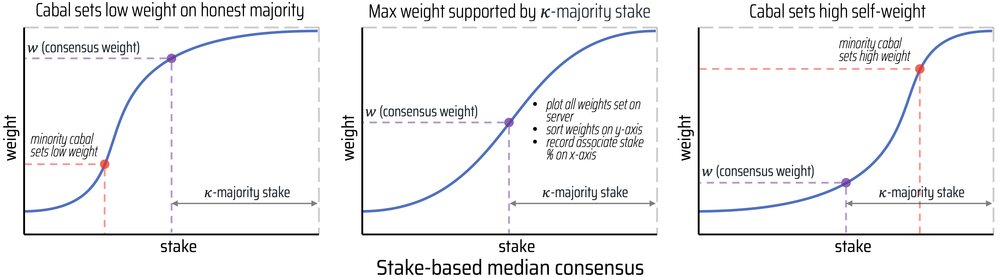

# Taonomics

Tao is the token for Bittensor and gatekeeps access, representing bandwidth to the network. The supply of Tao follows the same emission cycle as Bitcoin, with a max supply of 21,000,000 and a halving cycle every four years. After each cycle, emissions per block decrease by 50%. Currently, one Tao is issued every block (12 seconds). The first halving will be October 2025.

\\[ \frac{\sum _{i=0}^{32}210000\left[\frac{50*10^8}{2^i}\right]}{10^8} \\]

**Emission Split**: Each subnetwork \\[h\\] receives a set percentage \\[E_h\\] of total emission \\[E=\sum_h E_h\\].
Servers and Validators evenly split emissions per block, with the most emissions issued to the best-performing Servers and largest Validators.

**Weights**: Each Validator \\[i\\] evaluates the relative utility of each Server \\[j\\], and sets weights \\[\sum_jW_{ij}=1\\] on-chain, signed with the Validator hotkey. A relatively high weight indicates relatively high Server utility.

**Prerank**: Server rank \\[R_j\\] is the sum of weighted stake set on \\[j\\], before consensus. A high rank indicates that majority stake agrees on relatively high utility of a Server.
\\[P_j = \sum_i S_i \cdot W_{ij}\\]

**Consensus**: On-chain consensus then calculates stake-based median weight \\[C_j\\] for each Server \\[j\\], which is the maximum weight supported by at least \\[\kappa\\]-majority stake, so that stake sum (as ratio of total active stake) of active Validators setting at least consensus weight is \\[\kappa\\] (typically \\[\kappa=0.5\\]).
\\[C_j = \max w:\quad \kappa \le \sum_i S_i \cdot \left( w \le W_{ij} \right)\\]

**Validator Trust**: Clip weights above consensus to penalize overweighting, the sum of consensus-clipped weight is then Validator trust \\[V_i\\], which is the weighting power remaining after consensus (initially starts with 100% power). High Validator trust means it is typically setting weights in agreement with majority stake.
\\[V_i = \sum_j\min\left( W_{ij}, C_j \right)\\]

**Server Incentive**: Server rank \\[R_j\\] is the sum of weighted stake set on \\[j\\], which is also the Server incentive ratio \\[I_j\\]. Better performing Servers get relatively higher rank and incentive.
\\[I_j = R_j = \sum_i S_i \cdot \min\left( W_{ij}, C_j \right)\\]

**Server Trust**: The ratio of Server \\[j\\] rank \\[R_j\\] to its prerank \\[P_j\\] is the trust \\[T_j\\] in the initial weights set on the Server. High Server trust indicates that mostly trusted Validators set weights on it.
\\[T_j = \frac{R_j}{P_j}\\]

**Validator Bonds**: Validators accumulate bonded relationships \\[B_{ij}\\] in the Servers they rank, adding \\[\Delta B_{ij} = S_i \cdot \min \left( W_{ij}, C_j \right)\\] (normalized across Validators) via exponential moving average at each epoch \\[t\\] (typically \\[\alpha=0.1\\]).
\\[B_{ij}^{(t)} = \alpha \Delta B_{ij} + (1-\alpha) B_{ij}^{(t-1)} \\]

**Validator Reward**: Validators receive a portion (typically 50%) of the incentive of bonded Servers as reward \\[D_i\\] for setting weights in consensus.
\\[D_i = \sum_j B_{ij} \cdot I_j\\]

**Emission**: Neurons can simultaneously act as Server and Validator, and generally its emission comprises Server incentive \\[I_i/2\\] and Validator reward \\[D_i/2\\], since it is granting half incentive to its bondholders and gains half incentive from those Servers it is bonded to.
\\[E_i = \left(I_i + D_i\right)\left/2\right.\\]

**Consensus Guarantees**: Unfairly high self-weight set by minority-stake cabals gets clipped at consensus and removes significant voting power. Optimal cabal attacks aim to set self-weights that maximize honest self-weight (utility) required for retaining majority stake. Subtensor implements on-chain consensus and verifies its guarantees via integration tests. It also maps guarantees for given weight standard deviations by simulating large networks and optimizing cabal attacks.

We assume majority stake is honest and sets accurate weights on the entire network, while minority stake can form a cabal that colludes to maximize its emission by setting high self-weight. Weights standard deviation is the extent of natural deviation due to sampling noise of validators measuring server performance, where each validator sets a different weight on a given server. Higher weight deviation increases the major utility requirement, since noise weakens the consensus. However, weights standard deviation is typically less than 40%, and if at least 60% stake is honest and controls 73% utility then it can still retain its stake, since it will receive at least 60% of emissions.

**KEY**
---
B = Bonds

C = Consensus

I = Incentive

R = Rank

S = Stake

T = Server Trust

V = Validator Trust

W = Weight
