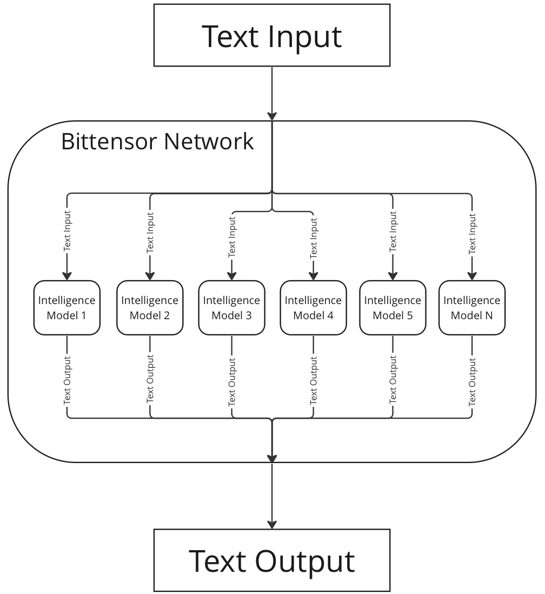

# The Bittensor Protocol

Bittensor provides an API for accessing machine learning models hosted on the Bittensor network. The network uses incentives to ensure these models are valuable and aligned to clients needs by driving the network towards producing maximal value, diversity, and low inference latency.

<p align="center">

</p>

Bittensor absorbs various modalities of machine intelligence, all of which are accessible through the API. Currently, those supported include text completion and causal language modelling tasks. 

# Use Cases

Here are a few examples of the functions that large language models on Bittensor enable users to do.

## Text Completion

The Bittensor network is composed of a variety of different models such as Llama, GPT4all, Vicuna, etc. that can be queried collectively or individually to solve natural language tasks such as text completion.

``` python
In [4]: llm("Heraclitus was a ")
Out[4]: 'Greek philosopher known for his doctrine of change and the famous quote, "No man ever steps in the same river twice."'
```

## ****Text Classification****

The diversity of models on the Bittensor network enable users to attain a variety of perspectives on a single problem. By gathering multiple responses, applications and users can improve their understanding of a specific domain problem — like sentiment analysis.

``` python
In [9]: llm("What is the sentiment of the following: 'I love Bittensor")
Out[9]: 'The sentiment of the statement "I love Bittensor" is positive.'
```